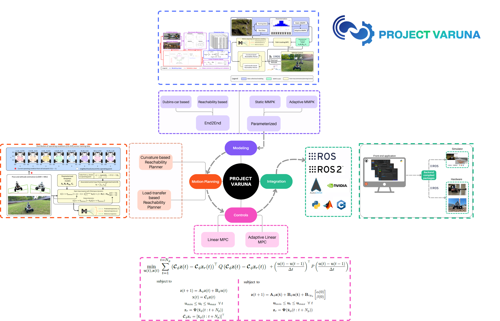
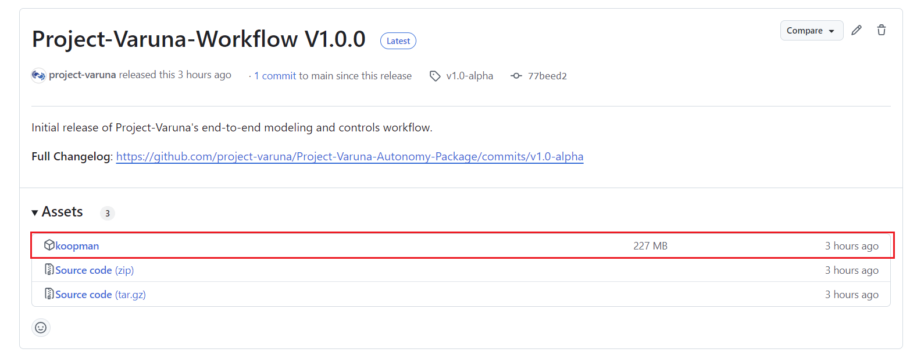
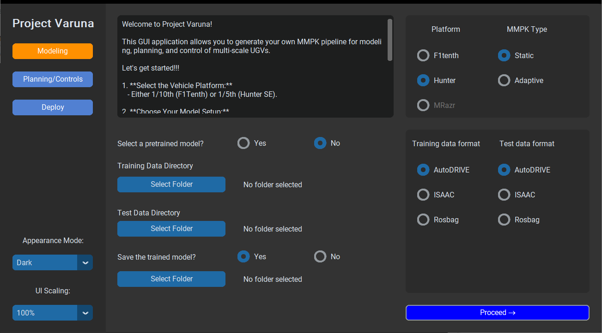
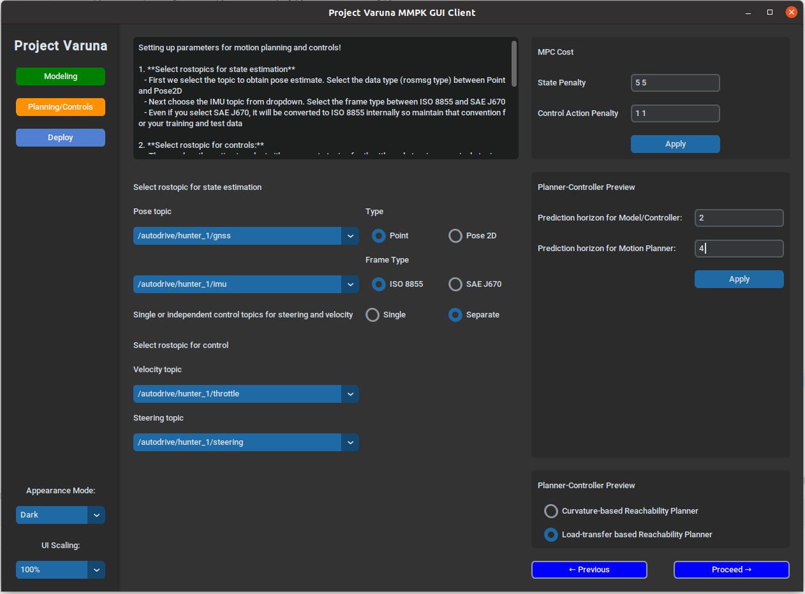
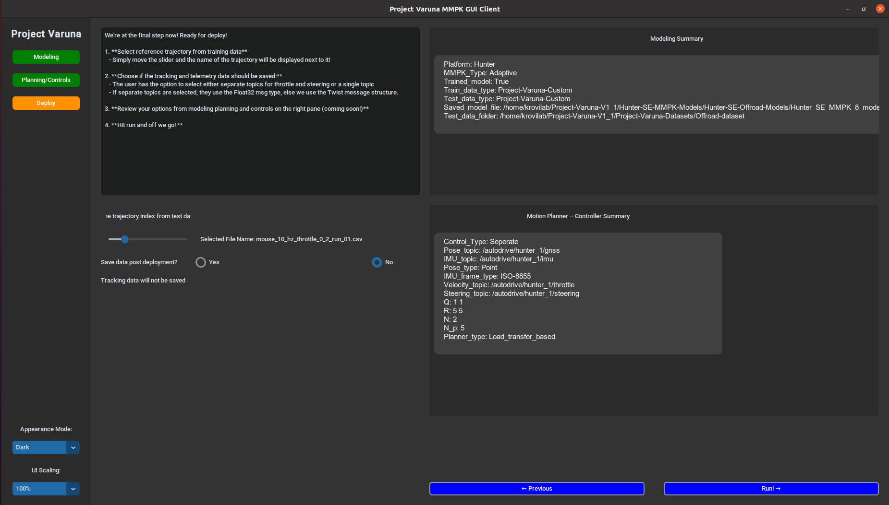

# Project Varuna

Project Varuna is a versatile framework for modeling, planning, and control of autonomous vehicles, leveraging the Koopman Operator Theory for explainable, data-driven models. This guide will walk you through the setup and usage of Project Varuna, including the steps for navigating the user interface.



## Getting Started

### Prerequisites
Ensure you have Python 3.8+ installed along with ROS1 noetic.

### Installation

1. **Clone the Repository**  
   First, clone this repository:
   ```bash
   git clone https://github.com/project-varuna/Project-Varuna-Autonomy-Package.git

2. **Download the package file**  
    

   Download the latest package file from the [Releases](https://github.com/project-varuna/Project-Varuna-Autonomy-Package/releases) page and place it in the repository's root directory.


3. **Install Requirements**  
   Install the dependencies, primarily `customtkinter` for the front-end application:

   ```bash
   pip install -r requirements.txt

## Running the Application  
To launch the Project Varuna front-end interface, run:

```bash
python3 Project-Varuna-GUI.py
```

---
## Usage Guide  

Once the application is running, follow these key steps for a seamless experience with modeling, planning, and control tasks in Project Varuna.

### Navigating the User Interface
The user application consists of 3 sections for modeling, planning/ controls and deployment.
Following instructions highlight this process:

#### Data Selection & Platform Setup



- Select training data or pretrained models from the interface.
- Load your test data and specify the platform for deployment.

#### Configure Motion Planning and Control Parameters


- Choose your motion planner and adjust Model Predictive Control (MPC) penalties to optimize performance.
- Set relevant ROS topics based on your chosen platform for system integration.
- Select topics for:
  - **Localized pose**: Can be of type `Point` or `Pose 2D`.
  - **IMU data**: For tracking the vehicle's attitude.
  - **Control topics**: Either using `Twist` messages or decoupled throttle and steering messages with the `Float` message type.

#### Execute Path Tracking

- Pick your desired path, configure final settings, and initiate the execution to begin path tracking.

Now, you're ready to go!


## Contact

For questions, feedback, or support, please reach out to the Project Varuna team:

- **Email**: [ajinkya.projectvaruna@gmail.com](ajinkya.projectvaruna@gmail.com)
- **GitHub Issues**: For any bug reports or feature requests, use the [issue tracker](https://github.com/yourusername/Project-Varuna/issues).
- **Contributors**: If you’d like to collaborate or discuss larger contributions, feel free to reach out directly!


## Citation

If you use Project-Varuna for research or validation purposes, please reference and cite the following:

#### [Expanding Autonomous Ground Vehicle Navigation Capabilities through a Multi-Model Parameterized Koopman Framework](https://www.researchgate.net/publication/380152547_Expanding_Autonomous_Ground_Vehicle_Navigation_Capabilities_through_a_Multi-Model_Parameterized_Koopman_Framework)
```bibtex
@unknown{Joglekar_MMPK,
author = {Joglekar, Ajinkya and Samak, Chinmay and Samak, Tanmay and Krovi, Venkat and Vaidya, Umesh},
year = {2024},
month = {04},
pages = {},
title = {Expanding Autonomous Ground Vehicle Navigation Capabilities through a Multi-Model Parameterized Koopman Framework},
doi = {10.13140/RG.2.2.33007.24485}
}
```

#### [Modeling and Control of Off-road Autonomous Vehicles with Situationally Aware Data-Driven Framework](https://www.researchgate.net/publication/383427789_Modeling_and_Control_of_Off-road_Autonomous_Vehicles_with_Situationally_Aware_Data-Driven_Framework)
```bibtex
@unknown{Joglekar_Adaptive_MMPK,
author = {Joglekar, Ajinkya and Vaidya, Umesh and Krovi, Venkat},
year = {2024},
month = {08},
pages = {},
title = {Modeling and Control of Off-road Autonomous Vehicles with Situationally Aware Data-Driven Framework},
doi = {10.13140/RG.2.2.13288.48642}
}
```


#### [Data-Driven Modeling and Experimental Validation of Autonomous Vehicles Using Koopman Operator](https://www.researchgate.net/publication/380152547_Expanding_Autonomous_Ground_Vehicle_Navigation_Capabilities_through_a_Multi-Model_Parameterized_Koopman_Framework)
```bibtex
@inproceedings{inproceedings,
author = {Joglekar, Ajinkya and Sutavani, Sarang and Samak, Chinmay and Samak, Tanmay and Kosaraju, Krishna and Smereka, Jonathon and Gorsich, David and Vaidya, Umesh and Krovi, Venkat},
year = {2023},
month = {10},
pages = {9442-9447},
title = {Data-Driven Modeling and Experimental Validation of Autonomous Vehicles Using Koopman Operator},
doi = {10.1109/IROS55552.2023.10341797}
}
```

#### [Analytical Construction of Koopman EDMD Candidate Functions for Optimal Control of Ackermann-Steered Vehicles](https://par.nsf.gov/servlets/purl/10491343)
```bibtex
@article{article,
author = {Joglekar, Ajinkya and Samak, Chinmay and Samak, Tanmay and Kosaraju, Krishna and Smereka, Jonathon and Brudnak, Mark and Gorsich, David and Krovi, Venkat and Vaidya, Umesh},
year = {2023},
month = {01},
pages = {619-624},
title = {Analytical Construction of Koopman EDMD Candidate Functions for Optimal Control of Ackermann-Steered Vehicles},
volume = {56},
journal = {IFAC-PapersOnLine},
doi = {10.1016/j.ifacol.2023.12.093}
}
```