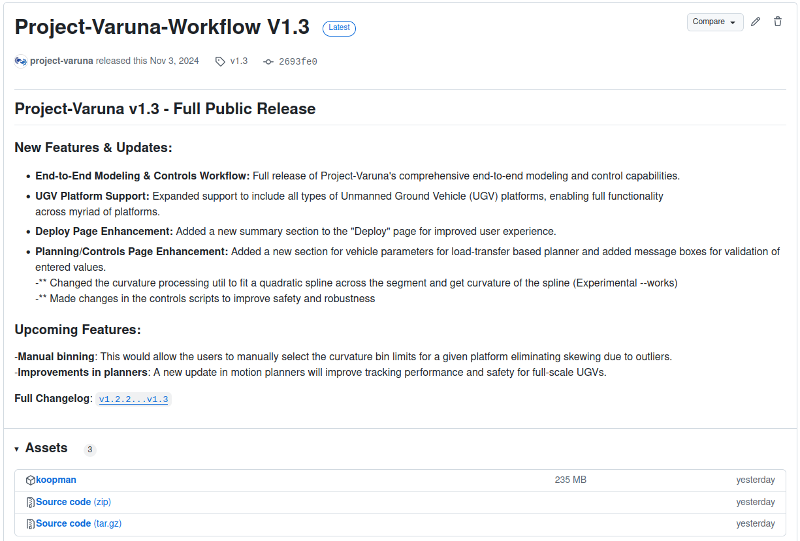
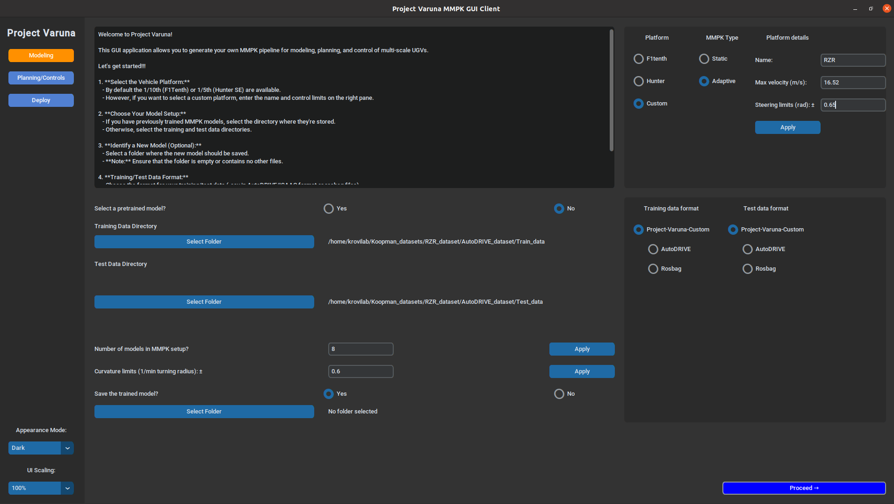
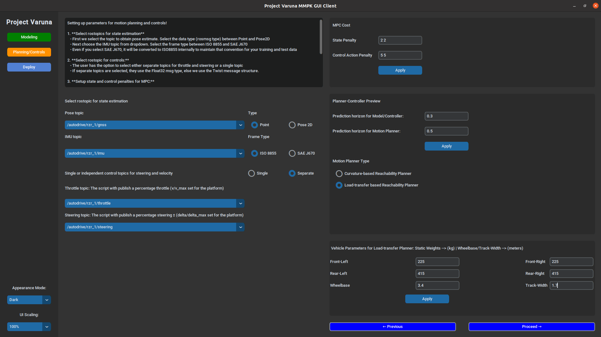
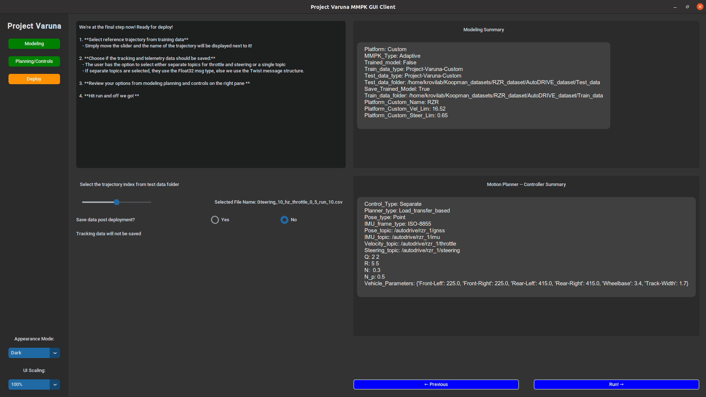

# Project Varuna

Project Varuna is a versatile framework for modeling, planning, and control of autonomous vehicles, leveraging the Koopman Operator Theory for explainable, data-driven models. This guide will walk you through the setup and usage of Project Varuna, including the steps for navigating the user interface.


## Getting Started

### Prerequisites
Ensure you have Python 3.8+ installed along with ROS1 noetic.

### Installation

1. **Clone the Repository**  
   First, clone this repository:
   ```bash
   git clone https://github.com/project-varuna/Project-Varuna-Autonomy-Package.git

2. **Download the package file**  
    

   Download the latest package file from the [Releases](https://github.com/project-varuna/Project-Varuna-Autonomy-Package/releases) page and place it in the repository's root directory.


3. **Install Requirements**  
   Install the dependencies, primarily `customtkinter` for the front-end application:

   ```bash
   pip install -r requirements.txt

## Running the Application  

**Note: IMPORTANT**  
Before you launch the GUI, make sure that you launch all the relevant `roslaunch` files for your simulator/hardware and that the relevant nodes/topics are published.

Additionally, make sure the binary has been given the required permissions using:

```bash
chmod +x koopman
```

To launch the Project Varuna front-end interface, run:
```bash
python3 Project-Varuna-GUI.py
```

---
## Usage Guide  

Once the application is running, follow these key steps for a seamless experience with modeling, planning, and control tasks in Project Varuna.

### Navigating the User Interface
The user application consists of 3 sections for modeling, planning/ controls and deployment.
Following instructions highlight this process:

#### Step I: Data Selection & Platform Setup


- Select training data or pretrained models from the interface.
  - If you are training a model from scratch select the following in addition to training data folder:
  - Select the number for models in MMPK.
  - Set the curvature limits for the platform. 
  - The training module will divide the training data based on number of models selected within the curvature constraints.
- Load your test data.
- Looking at the right pane, select the platform of your choice.
- Select the type of MMPK models: Static (suitable for on-road) or Adaptive (suitable for on/off-road).


#### Step II: Configure Motion Planning and Control Parameters

On this page, we select the mapping for ros topics, select motion planner and controller properties.
- **Set Relevant ROS Topics**: Configure the appropriate ROS topics based on your chosen platform for seamless system integration. Topics to set include:
  - **Localized Pose**: Choose either `Point` or `Pose 2D` for localized positioning data.
  - **IMU Data**: Select the IMU data for tracking the vehicle's attitude (orientation).
  - **Control Topics**: Choose between:
    - `Twist` messages for integrated velocity and steering control.
    - Decoupled `Float` messages for separate throttle and steering controls.


- **Set Cost Matrices (Q, R) for MPC**: Input two integers separated by a space:
  - **State Matrix (Q)**: Penalties for position (`r`) and orientation (`θ`).
  - **Control Matrix (R)**: Penalties for rate of change of velocity (`v`) and steering angle (`δ`).


- **Set Preview Horizons**
- **Model Horizon**: This parameter defines the horizon over which curvature at each instance is calculated, affecting the binning within the curvature bins. 
  - **Hint**: Adjust based on the platform's speed and curvature limits. A higher value will create sparser data at the edges, especially for full-scale vehicles.
  - Conversely, setting the horizon too low will result in frequent switching during runtime.
  - **Important**: Tuning the model horizon, number of models, and curvature limits is critical for successful deployment.

- **Planner Horizon**: This horizon defines the open-loop prediction duration across multiple models. It should ideally be greater than the model horizon.
  - **Tip**: Tune this horizon based on your model horizon to ensure optimal performance.


- **Select Planner Type**
    - **Curvature-based Planner**: Samples trajectories using each model in MMPK by satisfying curvature constraints for associated bins.
    - **Load-transfer based Planner**: Considers the current dynamic CG of the vehicle and samples trajectories to satisfy the curvature constraints as well as current operating conditions. Suitable for off-road environments.


- **Input vehicle static loads**
  - If you have selected **Adaptive MMPK** in the prior screen, please provide static loads on each wheel (kg) along with wheel base and track-width of the vehicle (m). This is required for off-road planners to compute terrain induced shift in CG.

---
- **Key Points**:
- Adjust parameters like the **model horizon** and **planner horizon** carefully to balance performance and runtime stability.
- Ensure the **cost matrices (Q, R)** align with your vehicle's dynamics and control characteristics.
---


#### Step III: Select the test trajectory, review selections and run

- Pick your desired path, configure final settings, and initiate the execution to begin path tracking.
Now, you're ready to go!


## Contact

For questions, feedback, or support, please reach out to the Project Varuna team:

- **Email**: [ajinkya.projectvaruna@gmail.com](ajinkya.projectvaruna@gmail.com)
- **GitHub Issues**: For any bug reports or feature requests, use the [issue tracker](https://github.com/yourusername/Project-Varuna/issues).
- **Contributors**: If you’d like to collaborate or discuss larger contributions, feel free to reach out directly!


## Citation

If you use Project-Varuna for research or validation purposes, please reference and cite the following:

#### [Expanding Autonomous Ground Vehicle Navigation Capabilities through a Multi-Model Parameterized Koopman Framework](https://www.researchgate.net/publication/380152547_Expanding_Autonomous_Ground_Vehicle_Navigation_Capabilities_through_a_Multi-Model_Parameterized_Koopman_Framework)
```bibtex
@unknown{Joglekar_MMPK,
author = {Joglekar, Ajinkya and Samak, Chinmay and Samak, Tanmay and Krovi, Venkat and Vaidya, Umesh},
year = {2024},
month = {04},
pages = {},
title = {Expanding Autonomous Ground Vehicle Navigation Capabilities through a Multi-Model Parameterized Koopman Framework},
doi = {10.13140/RG.2.2.33007.24485}
}
```

#### [Modeling and Control of Off-road Autonomous Vehicles with Situationally Aware Data-Driven Framework](https://www.researchgate.net/publication/383427789_Modeling_and_Control_of_Off-road_Autonomous_Vehicles_with_Situationally_Aware_Data-Driven_Framework)
```bibtex
@unknown{Joglekar_Adaptive_MMPK,
author = {Joglekar, Ajinkya and Vaidya, Umesh and Krovi, Venkat},
year = {2024},
month = {08},
pages = {},
title = {Modeling and Control of Off-road Autonomous Vehicles with Situationally Aware Data-Driven Framework},
doi = {10.13140/RG.2.2.13288.48642}
}
```


#### [Data-Driven Modeling and Experimental Validation of Autonomous Vehicles Using Koopman Operator](https://www.researchgate.net/publication/380152547_Expanding_Autonomous_Ground_Vehicle_Navigation_Capabilities_through_a_Multi-Model_Parameterized_Koopman_Framework)
```bibtex
@inproceedings{inproceedings,
author = {Joglekar, Ajinkya and Sutavani, Sarang and Samak, Chinmay and Samak, Tanmay and Kosaraju, Krishna and Smereka, Jonathon and Gorsich, David and Vaidya, Umesh and Krovi, Venkat},
year = {2023},
month = {10},
pages = {9442-9447},
title = {Data-Driven Modeling and Experimental Validation of Autonomous Vehicles Using Koopman Operator},
doi = {10.1109/IROS55552.2023.10341797}
}
```

#### [Analytical Construction of Koopman EDMD Candidate Functions for Optimal Control of Ackermann-Steered Vehicles](https://par.nsf.gov/servlets/purl/10491343)
```bibtex
@article{article,
author = {Joglekar, Ajinkya and Samak, Chinmay and Samak, Tanmay and Kosaraju, Krishna and Smereka, Jonathon and Brudnak, Mark and Gorsich, David and Krovi, Venkat and Vaidya, Umesh},
year = {2023},
month = {01},
pages = {619-624},
title = {Analytical Construction of Koopman EDMD Candidate Functions for Optimal Control of Ackermann-Steered Vehicles},
volume = {56},
journal = {IFAC-PapersOnLine},
doi = {10.1016/j.ifacol.2023.12.093}
}
```
